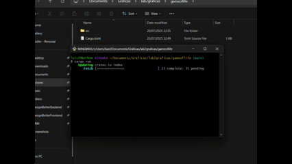

# Juego de la Vida - Rust (Lab 2 Gráficas)

Este es un proyecto del laboratorio de gráficas en Rust, donde se implementa el **Juego de la Vida de Conway** usando la librería `minifb`.

## Ejecución

1. Ve al directorio del proyecto:
   ```bash
   cd gameoflife
2. Corre el programa:

   ```bash

   cargo run --release

  ## Ejemplo en acción
  
  
  


Autor: Luis Palacios
